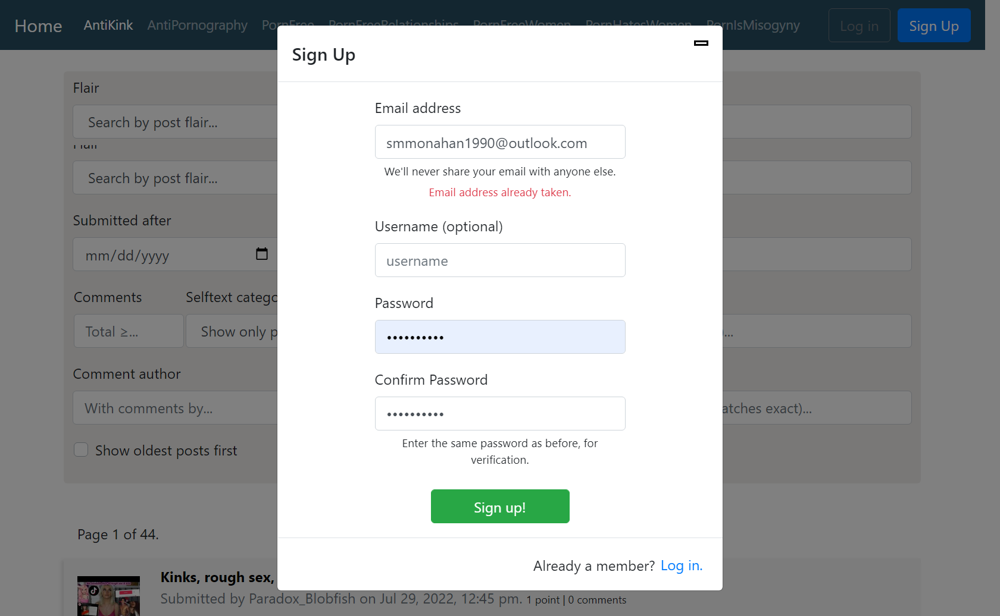

# demosby.me
https://demosby.me 

Single-page reddit archive application built in ReactJS and Django Rest Framework. 

Please report bugs to admin@demosby.me.

## Frontend
> The frontend is a fast, interactive and simple single-page application written in Typescript and built with the following technologies: 
> * [React v17](https://facebook.github.io/react)
> * [React Router v5](https://github.com/ReactTraining/react-router)
> * [React Native Async Storage v1](https://github.com/react-native-async-storage/async-storage)

## Demo Screenshots 
<!--  -->

  

Login Screen

<!--  -->

  

Login Fail

<!--  -->

  

Signup Fail

## Demo Moderation Tools 
<!--  -->

  <!---->
  

Using the inline moderation tools to mark a post "not safe for work."

